# RIMAS

**RIMAS(Recommendation Intelligence Music Assistant System)**는 사용자의 대화 맥락, 선호/비선호 정보, 그래프 기반 후보 탐색(KAG), 검색 기반 근거 조회(RAG)를 결합해 음악을 추천하는 멀티 에이전트 음악 큐레이션 서비스입니다.

---

## 발표용 요약

| 구분 | 핵심 내용 |
|---|---|
| 서비스 목표 | 자연어 요청과 사용자 취향을 반영해 개인화 음악 추천, 신규 음악 탐색, 챗봇 기반 추천을 제공 |
| 추천 구조 | `InputPlanner -> KAG -> ContractValidator -> RAG -> Intent -> Recommendation -> ResponseGenerator -> Validator` |
| 데이터 저장소 | PostgreSQL(RDB), Neo4j(GraphDB), Elasticsearch(Vector/Search DB), Redis(Session Cache) |
| 환각 방지 | KAG 후보 `content_id` 안에서만 RAG 검색, RAG 근거와 응답 결과의 `content_id/title/artist` 일치 검증 |
| 출처 표시 | 상세 조회 모델의 `source`, `evidence_summary`를 상세 모달의 큐레이션 근거 영역에 노출. 추천 카드에는 원문 trace를 직접 노출하지 않음 |
| 검증 상태 | Backend pytest 20건 통과, Frontend build/lint 통과, `app.main` import smoke 통과 |

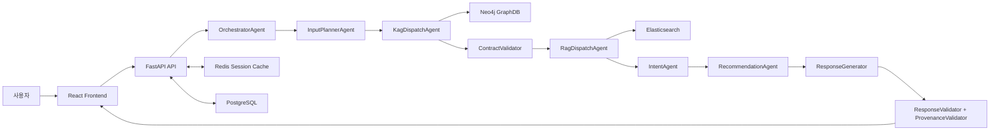

---

## 최근 업데이트 반영 사항

| 영역 | 업데이트 내용 |
|---|---|
| RAG 구조 정리 | 레거시 RAG 진입점과 사용하지 않는 `ragStateBuilder`, `services/indexing.py`, `services/retrieval.py` 제거. 현재 경로는 `app/rag/adapters`, `app/rag/builders`, `app/rag/services/elasticsearch_retriever.py` 중심 |
| 로그 정책 | Backend 기본 로그 레벨을 `ERROR` 중심으로 낮추고, Frontend 성공 요청/응답 `console.log`를 제거해 오류 로그 위주로 정리 |
| 서비스 초기화 | API 라우트의 전역 서비스 생성을 lazy init으로 변경해 import 시 외부 DB 연결 부작용을 줄임 |
| KAG 어댑터 | `RIMAS_KAG_MODE=real`일 때만 Real Neo4j Adapter를 import하도록 분리 |
| 비선호 처리 | 사용자의 부정 표현에서 추출한 `disliked_artists`, `disliked_tracks`, `disliked_genres`를 KAG/RAG/최종 추천 선택 단계에서 제외 조건으로 반영 |
| 아티스트 지정 추천 | "아리아나 그란데 노래 추천"처럼 아티스트가 명시된 요청을 `artist_candidates`로 정규화하고, Real KAG에서 해당 artist 조건을 `Q_REC_006`에 우선 반영 |
| Discovery flow | "색다른", "새로운 취향", "안 듣던", "다른 분위기" 계열 요청을 `discovery_recommendation`으로 분류하고, Real KAG에서 `Q_REC_007` 다양성 추천과 `discovery_section`으로 라우팅 |
| 중복 추천 방지 | 챗봇 follow-up 추천 전에 Redis의 최신 response state에서 이미 표시된 추천 `content_id`를 읽어 `selected_tracks`에 병합 |
| Docker 개발 환경 | backend `uvicorn --reload` 감시 범위를 `--reload-dir app`으로 제한해 불필요한 reload와 로그 노이즈를 줄임 |
| 임시 산출물 정리 | `.pytest_cache`, Python `__pycache__`, `frontend/dist`, `tmp` 등 재생성 가능한 캐시/빌드 산출물 제거 |

---

## 전체 서비스 구조

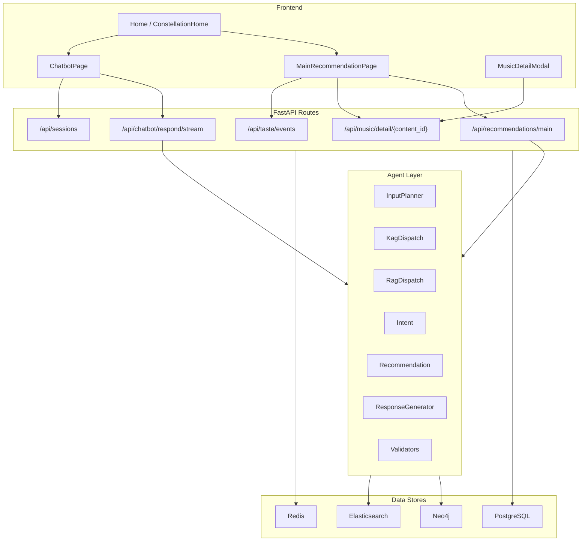

### 주요 모듈 책임

| 모듈 | 책임 |
|---|---|
| `app/api` | FastAPI route, 요청/응답 모델, service 호출 |
| `app/services` | 화면별 서비스 유스케이스, 세션 저장, 취향 저장, 로그 저장 |
| `app/agents` | 추천 파이프라인의 각 에이전트 실행 |
| `app/kag` | Neo4j 기반 후보 탐색, 그래프 query template, KAG state 생성 |
| `app/rag` | Elasticsearch 기반 후보 제한 검색, RAG state 생성 |
| `app/validators` | state contract, 응답 구조, provenance 검증 |
| `app/repositories` | PostgreSQL 접근 계층 |
| `frontend/src` | React 화면, API client, session/chat store |

---

## RAG 환각 방지 설계

RAG 환각 방지는 "LLM이 마음대로 곡/가수/추천 이유를 만들지 못하게 하는 것"을 목표로 구성되어 있습니다.

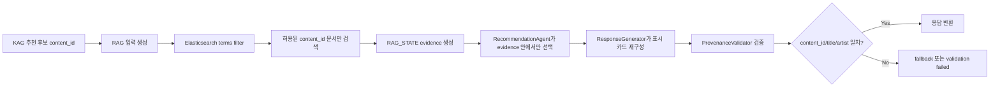

### 구현된 방어 장치

| 단계 | 방어 방식 | 구현 위치 |
|---|---|---|
| 후보 제한 | KAG가 만든 `recommended_content_ids`를 RAG 검색 범위로 사용 | `app/rag/adapters/rag_real_adapter.py` |
| 검색 필터 | Elasticsearch query의 `terms` filter로 `content_id`, `track_id`, `metadata.track_id` 계열 필드를 제한 | `app/rag/services/elasticsearch_retriever.py` |
| 아티스트 조건 우선 | 명시된 아티스트 alias를 `artist_candidates`로 정규화하고, Real KAG가 artist 조건이 있는 `Q_REC_006` 경로로 후보를 생성 | `app/common/constants.py`, `app/agents/input_planner_agent.py`, `app/agents/kag_dispatch_agent.py`, `app/kag/adapters/real_kag_adapter.py` |
| 비선호 제외 | disliked artist/track/genre가 KAG, RAG evidence, 최종 추천 선택에서 제외됨. comma-delimited genre도 정규화해 비교 | `app/common/genre_utils.py`, `app/agents/input_planner_agent.py`, `app/agents/kag_dispatch_agent.py`, `app/rag/adapters/rag_real_adapter.py`, `app/agents/recommendation_agent.py` |
| Discovery 중복 방지 | discovery 요청에서는 세션의 `selected_tracks`와 최신 표시 추천을 제외 후보로 넘겨 이미 본 곡이 다시 추천되는 것을 줄임 | `app/agents/input_planner_agent.py`, `app/services/chatbot_service.py`, `app/cache/latest_state_cache.py` |
| 응답 재구성 | LLM 응답의 추천 카드가 그대로 노출되지 않고, 선택된 추천 목록 기준으로 `content_id/title/artist`를 다시 구성 | `app/agents/response_generator.py` |
| 추천 이유 검증 | `display_reason`이 비어 있거나 너무 길거나 raw evidence를 복사하면 deterministic reason으로 대체 | `app/validators/display_reason_validator.py` |
| 출처 일치 검증 | 응답의 `used_content_ids`와 카드의 `title/artist`가 RAG evidence와 일치해야 통과 | `app/validators/provenance_validator.py` |

### 출처 표시 상태

| 화면/응답 | 현재 표시 정보 | 비고 |
|---|---|---|
| 추천 카드 | `content_id`, `title`, `artist`, `label`, `display_reason` | raw evidence와 retrieval trace는 직접 표시하지 않음 |
| 음악 상세 API/model | `source`, `evidence_summary` 포함 | 최근 RAG state가 있으면 `rag_state`, 없으면 catalog 기반. 상세 모달에서 큐레이션 근거와 검색 근거 요약으로 표시 |
| 내부 저장 | 최신 `KAG_STATE`, `RAG_STATE`, `RESPONSE_STATE`를 Redis에 저장 | provenance/debug 목적이며, 최신 response state는 이미 표시된 추천 곡 제외에도 사용 |

현재 발표에서는 "KAG/RAG 후보 생성과 검색 계약은 변경하지 않고, 내부 검증에 사용하던 상세 근거를 상세 모달에서 사용자에게 설명한다"라고 설명하는 것이 정확합니다. 추천 카드에는 원문 출처와 검색 trace를 직접 노출하지 않고, 상세 모달에서 `source`, `evidence_summary`를 큐레이션 근거로 보여줍니다.

---

## RDB 설계 정보

PostgreSQL은 사용자, 음악 카탈로그, 상호작용 로그, 세션 영속화, 취향/비선호 프로필을 관리합니다.

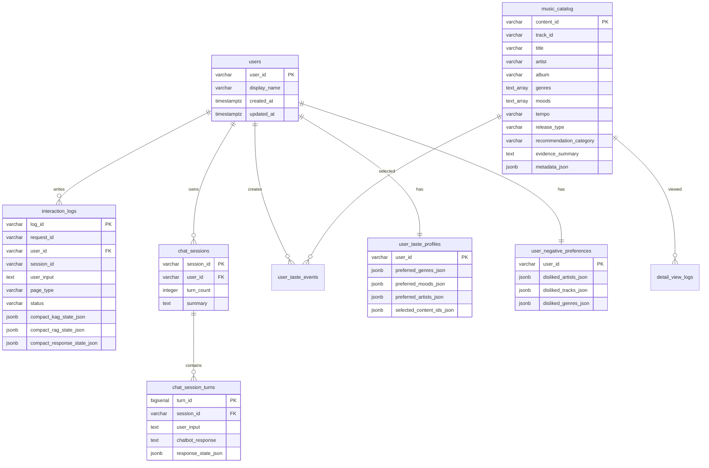

### 핵심 테이블

| 테이블 | 목적 |
|---|---|
| `music_catalog` | 추천 가능한 곡의 canonical catalog. 장르, 분위기, release type, 추천 category, evidence summary 저장 |
| `interaction_logs` | 요청별 compact KAG/RAG/Response state, validation 결과, latency 저장 |
| `chat_sessions`, `chat_session_turns` | Redis 세션을 PostgreSQL로 영속화할 때 사용하는 채팅 기록 |
| `user_taste_events` | "취향 추가" 이벤트 단위 로그 |
| `user_taste_profiles` | 선호 장르/분위기/아티스트/선택 곡 집계 프로필 |
| `user_negative_preferences` | 싫어하는 아티스트/곡/장르 저장 |

### 인덱스/제약

| 대상 | 설계 |
|---|---|
| `music_catalog.genres`, `music_catalog.moods` | GIN index로 배열 검색 최적화 |
| `music_catalog.metadata_json` | GIN index로 metadata JSON 검색 가능 |
| `interaction_logs` compact state | KAG/RAG/Response JSONB GIN index |
| enum성 컬럼 | `tempo`, `release_type`, `recommendation_category`, `page_type`, `status`, `validation_status`는 CHECK 제약으로 값 범위 제한 |

---

## GraphDB 설계 정보

Neo4j는 음악과 장르, 아티스트, 발매연도, 상황/감정 라벨 사이의 관계를 이용해 KAG 후보를 생성합니다.

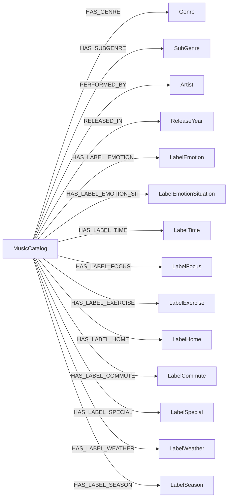

### KAG Query 유형

| Query Key | 용도 |
|---|---|
| `Q_SEARCH_001` | 곡명 키워드 기반 기본 정보 조회 |
| `Q_SEARCH_003` | genre/subgenre/artist/release_year 조건 검색 |
| `Q_SEARCH_004` | 기존 곡과 공유 feature가 많은 유사곡 조회 |
| `Q_SEARCH_005` | genre/artist/year 통계 조회 |
| `Q_SEARCH_012` | genre/mood/situation/weather 복합 조건 검색 |
| `Q_REC_001` | 장르 기반 추천 |
| `Q_REC_002` | mood 기반 추천 |
| `Q_REC_003` | 상황 기반 추천 |
| `Q_REC_004` | 날씨 기반 추천 |
| `Q_REC_005` | 유사곡 추천 |
| `Q_REC_006` | 인기도 기반 추천. artist 조건이 있으면 아티스트 지정 추천 후보 생성에 사용 |
| `Q_REC_007` | 다양성 추천. discovery flow에서 아티스트 중복을 줄인 후보 생성에 사용 |
| `Q_REC_008` | genre/mood/situation/weather 하이브리드 추천 |

KAG 결과는 `recommended_content_ids`, `candidate_tracks`, `matched_nodes`, `excluded_nodes`, `recommendation_goal`, `target_section` 형태의 state로 내려오며, 이후 RAG 검색 범위를 제한하는 기준이 됩니다.

---

## VectorDB / Elasticsearch 설계

현재 런타임 RAG는 Elasticsearch를 사용합니다. 인덱싱 스크립트는 `data/elasticsearch/*.json` 또는 지정한 JSON/NDJSON 파일을 읽어 문서 단위로 색인합니다.

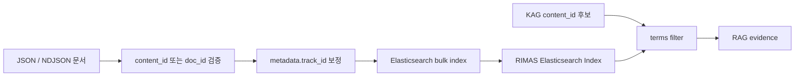

### 인덱스 필드

| 필드 | 타입/역할 |
|---|---|
| `content_id` | keyword. KAG 후보와 RAG evidence를 연결하는 핵심 ID |
| `title`, `artist`, `album` | text. 검색/표시 정보 |
| `genre`, `mood` | keyword. 필터/분류 정보 |
| `content`, `text` | text. 추천 근거 검색 대상 |
| `metadata.track_id`, `metadata.doc_id` | keyword. content_id 보정 및 후보 제한 검색 대상 |
| `metadata.song`, `metadata.track_name`, `metadata.artist`, `metadata.genre`, `metadata.emotion` | text. multi-match 검색 대상 |

### 문서 청킹 기준

현재 코드 기준으로는 토큰 길이 기반의 의미적 chunking을 런타임 색인 단계에서 수행하지 않습니다.

| 경로 | 현재 기준 |
|---|---|
| `scripts/load_elasticsearch.py` | JSON/NDJSON의 각 object를 하나의 Elasticsearch 문서로 색인 |
| `app/rag/musicCatalogRepository/loader.py` | Spotify row 1개를 track 문서 1개로 생성. `chunk_size=1`은 출력 CSV 파일 분할 기준이며 텍스트 청킹 기준은 아님 |
| `app/rag/musicCatalogRepository/loader_lyrics.py` | lyrics row 1개를 lyrics 문서 1개로 생성. `chunk_size=500`은 출력 JSON 파일 분할 기준이며 텍스트 청킹 기준은 아님 |

따라서 발표에서는 "현재 VectorDB 문서 단위는 곡/가사 row 기준이며, 긴 가사를 토큰 길이로 재분할하는 semantic chunking은 아직 적용하지 않았다"라고 설명하는 것이 정확합니다. 긴 가사 원문을 더 안정적으로 다루려면 `track_id + chunk_index` 기반의 별도 chunk 문서 설계가 추가로 필요합니다.

---

## 수집 데이터와 전처리

### 데이터 소스

| 데이터 | 코드상 경로 | 사용 목적 |
|---|---|---|
| 음악 카탈로그 CSV | `neo4j/data/music_catalog.csv` | 곡 기본 정보, 장르, 앨범, 인기도, audio feature |
| 상황 라벨 CSV | `neo4j/data/music_catalog_scenarios.csv` | 감정, 시간, 운동, 집, 출퇴근, 날씨, 계절 등 context label |
| Elasticsearch 문서 | `data/elasticsearch/*.json` | RAG 근거 검색용 문서 |
| legacy Spotify/Kaggle sample | `app/rag/data/spotify_20k_sample.json`, `spotify_60k_sampled.json` 기준 loader 코드 존재 | embedding 문서 생성용 legacy 경로 |

### PostgreSQL 전처리 흐름

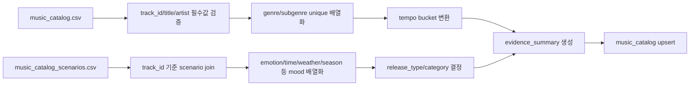

| 전처리 항목 | 기준 |
|---|---|
| `content_id` | `track_id`를 canonical ID로 사용 |
| `genres` | `playlist_genre`, `playlist_subgenre`를 정리 후 중복 제거 |
| `moods` | scenario CSV의 `emotion`, `emotion_situation`, `time`, `focus`, `exercise`, `home`, `commute`, `special`, `weather`, `season` 값을 `;` 기준 분리 후 중복 제거 |
| `release_type` | release date가 `2024-01-01` 이상이면 `new_release`, 아니면 `existing_catalog` |
| `recommendation_category` | 신규 발매는 `new_release`, mood/subgenre가 있으면 `discovery_candidate`, 그 외 `personalized_match` |
| `tempo` | `<90 slow`, `90~140 medium`, `>140 fast`, 파싱 실패 시 `unknown` |
| `metadata_json` | 인기도, 발매일, playlist 정보, audio feature, scenario label 저장 |

---

## 주요 서비스 시퀀스 다이어그램

### 1. 메인 추천 페이지

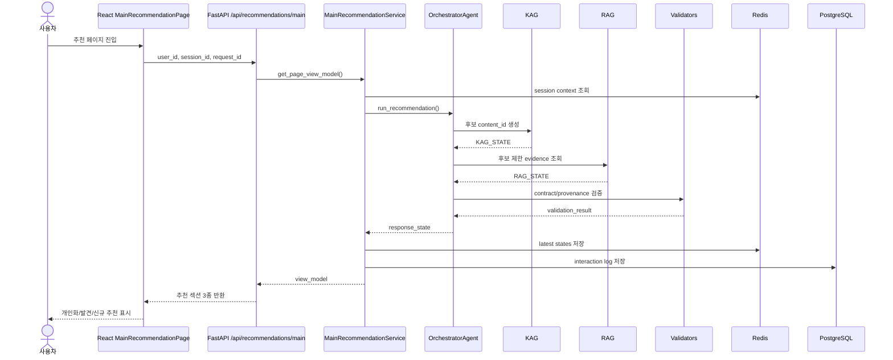

### 2. 챗봇 추천 스트리밍

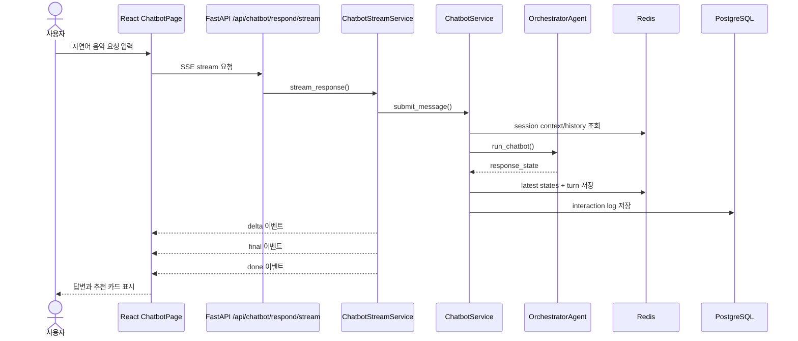

### 3. 음악 상세 조회

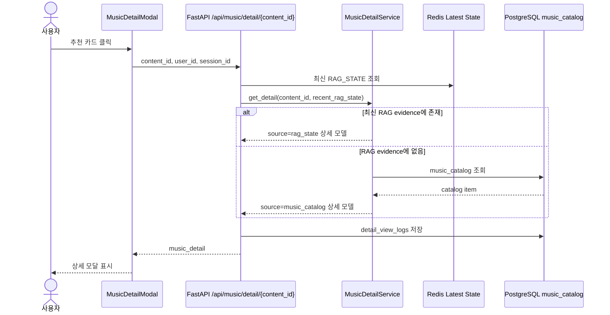

### 4. 취향 추가와 세션 종료

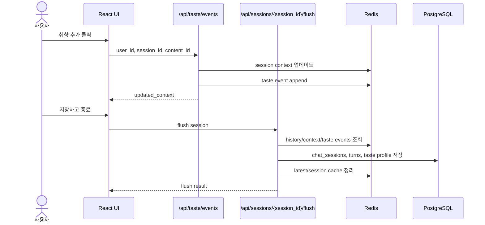

---

## 화면 설계서

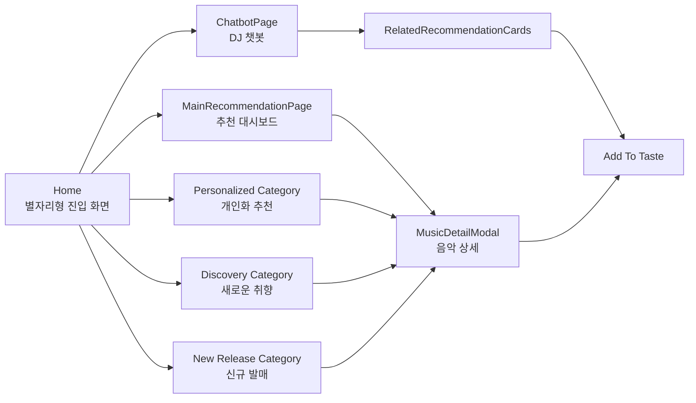

| 화면 | 주요 컴포넌트 | 사용자 행동 | API |
|---|---|---|---|
| Home | `ConstellationHome`, `OrbitNode`, `CenterMascotOrb` | 추천/발견/신규/챗봇 진입 | 없음 |
| MainRecommendationPage | `TopTasteHeader`, `CharacterDjBanner`, `RecommendationSection`, `RecommendationCard` | 추천 섹션 조회, 상세 열기, 챗봇 이동 | `/api/recommendations/main` |
| Category Page | `MainRecommendationPage(category=...)` | 특정 추천 섹션만 집중 조회 | `/api/recommendations/main` |
| ChatbotPage | `ChatbotHeader`, `ChatHistory`, `ChatInput`, `RelatedRecommendationCards` | 자연어 요청, SSE 응답 수신, 추천 카드 취향 추가 | `/api/chatbot/respond/stream`, `/api/sessions/{session_id}/history`, `/api/sessions/{session_id}/flush` |
| MusicDetailModal | `MusicDetailModal` | 곡 상세 확인, 취향 추가 | `/api/music/detail/{content_id}`, `/api/taste/events` |

### 화면별 표시 데이터

| 데이터 | 표시 위치 |
|---|---|
| `taste_badges`, `today_theme` | 메인 추천 상단 |
| `personalized`, `discovery`, `new_release` | 추천 섹션 |
| `display_reason` | 추천 카드 및 챗봇 관련 추천 카드 |
| `source`, `evidence_summary` | 음악 상세 모달의 큐레이션 근거 영역 |
| `session_degraded` | Redis 장애 등 세션 기능 제한 시 배너 |

---

## 테스트 시나리오 및 결과

### 최근 검증 명령

| 검증 | 명령 | 결과 |
|---|---|---|
| FastAPI import smoke | `.venv\Scripts\python.exe -c "import app.main; print('import_app_main_ok')"` | `import_app_main_ok` |
| Frontend lint | `npm run lint` in `frontend` | 통과 |
| Frontend build | `npm run build` in `frontend` | 통과 |
| Backend unit test | `C:\Python314\python.exe -m pytest -v` | `20 passed` |

### 테스트 시나리오

| 테스트 파일 | 시나리오 |
|---|---|
| `tests/test_orchestrator_session_dislikes.py` | 성공 응답과 fallback 응답 모두 session cache metadata에 `disliked_genres`가 유지되는지 검증 |
| `tests/test_negative_preference_filtering.py` | 현재 turn의 부정 장르가 KAG adapter context에 병합되는지 검증 |
| `tests/test_negative_preference_filtering.py` | "pop 별로" 같은 부정 표현이 positive genre 후보로 들어가지 않는지 검증 |
| `tests/test_negative_preference_filtering.py` | Real KAG Adapter가 excluded genre를 positive 조건으로 사용하지 않는지 검증 |
| `tests/test_negative_preference_filtering.py` | comma-delimited genre 값에서도 disliked genre가 KAG/RAG/Recommendation 단계에서 제외되는지 검증 |
| `tests/test_artist_recommendation_flow.py` | 아티스트 지정 요청에서 alias 정규화, KAG context 전달, artist 조건 기반 Real KAG 라우팅을 검증 |
| `tests/test_discovery_recommendation_flow.py` | 새로운/다른 느낌의 요청을 discovery flow로 분류하고, 다양성 추천 쿼리와 기존 표시 추천 제외를 적용하는지 검증 |
| `tests/test_curator_ui_contract.py` | KAG/RAG 구현을 변경하지 않고 상세 모달의 큐레이션 근거 노출, 챗봇 카드 문구, README 출처 설명 계약을 검증 |

### 최근 통과 확인된 Artist Flow

| 테스트 | 검증 내용 |
|---|---|
| `test_input_planner_extracts_korean_artist_alias_for_artist_request` | "아리아나 그란데 노래 추천" 요청을 `Ariana Grande` 아티스트 후보로 정규화 |
| `test_kag_dispatch_passes_artist_candidates_to_adapter_context` | `artist_candidates`가 KAG adapter context로 전달되는지 검증 |
| `test_real_kag_adapter_uses_artist_condition_for_artist_request` | Real KAG Adapter가 artist 조건을 `Q_REC_006` 파라미터로 반영하고 해당 아티스트 후보를 반환 |

### 최근 통과 확인된 Discovery Flow

| 테스트 | 검증 내용 |
|---|---|
| `test_input_planner_classifies_colorful_new_request_as_discovery` | "색다른/새로운/다른 분위기" 계열 요청을 `discovery_recommendation`으로 분류하고, 기존 `selected_tracks`를 제외 조건에 포함 |
| `test_input_planner_classifies_different_from_my_taste_as_discovery` | "내 취향과 완전 다른 노래" 요청을 discovery flow로 분류하고 요청 곡 수와 기존 표시 추천 제외 조건을 유지 |
| `test_intent_agent_fallback_classifier_handles_colorful_new_request` | IntentAgent fallback 분류기도 discovery 요청을 동일하게 인식 |
| `test_real_kag_adapter_routes_discovery_to_diversity_query_and_section` | Real KAG Adapter가 discovery 요청을 `Q_REC_007`, `new_taste_discovery`, `discovery_section`으로 라우팅 |
| `test_chatbot_service_adds_latest_displayed_recommendations_to_selected_tracks` | Redis 최신 response state에 표시된 추천 곡을 챗봇 follow-up의 `selected_tracks`에 병합 |

### 최근 해결된 항목

| 항목 | 상태 | 반영 내용 |
|---|---|---|
| 사용자 노출 출처 | 해결 | KAG/RAG 후보 생성과 검색 계약은 변경하지 않고 상세 모달에 근거 출처/검색 근거 요약 섹션 추가 |

### 확인된 한계

| 항목 | 현재 상태 | 개선 방향 |
|---|---|---|
| RAG chunking | row/object 단위 문서 색인. 긴 텍스트의 토큰 기반 semantic chunking 없음 | `content_id + chunk_index` 구조와 chunk overlap 정책 설계 |
| 문서 인코딩 | 일부 기존 코드 주석/문자열에 깨진 한글이 남아 있음 | 사용자 노출 문구와 문서부터 UTF-8 기준으로 순차 정리 |
| 통합 검증 | unit/lint/import smoke 중심 | Docker 기반 Postgres/Redis/Neo4j/Elasticsearch e2e 시나리오 추가 |

---

## 실행 안내

### Backend

```powershell
.venv\Scripts\python.exe -m uvicorn app.main:app --reload
```

### Docker Compose

```powershell
docker compose up -d
```

backend 컨테이너는 개발 중 reload 감시 범위를 `app` 디렉터리로 제한합니다.

### Frontend

```powershell
cd frontend
npm install
npm run dev
```

### 주요 환경 변수

| 변수 | 설명 |
|---|---|
| `LOG_LEVEL` | Backend 로그 레벨. 기본값은 `ERROR` |
| `RIMAS_KAG_MODE` | `mock` 또는 `real`. `real`이면 Neo4j adapter 사용 |
| `RIMAS_RAG_MODE` | `mock` 또는 `real`. `real`이면 Elasticsearch retriever 사용 |
| `RIMAS_ELASTICSEARCH_URL` | Elasticsearch 접속 URL |
| `RIMAS_ELASTICSEARCH_INDEX` | RAG 검색 인덱스명 |
| `OPENAI_API_KEY` | LLM 응답 생성 사용 시 필요 |

---


```text
app/
  agents/          Orchestrator, InputPlanner, KAG/RAG Dispatch, Intent, Recommendation, ResponseGenerator, ValidatorController
  api/             FastAPI routes — chatbot (일반+스트리밍), recommendation, session, music, taste
  cache/           Redis 클라이언트, redis_keys, session_history_cache, latest_state_cache
  common/          constants (ALLOWED_MOODS/GENRES 등 enum), default_state (fallback), labels
  config/          settings.py (환경 변수 로드, prod fail-fast)
  contracts/       KagStateField, RagStateField, SessionContextField enum
  core/            logging_config, LoggingMiddleware
  json_templates/  Agent 간 계약 JSON 스키마 파일
  kag/             KAG 연결·쿼리·adapters (Mock / Real Neo4j)
  llm/             OpenAI LLM 클라이언트, response_state_schema
  policies/        RecommendationPolicy, RankingPolicy (Python)
  prompts/         LLM 프롬프트 — InputPlanner용 system prompt + JSON schema
  rag/             RAG adapters (Mock / Real Elasticsearch), services, builders, validators
  repositories/    BaseRepository, query_constants, PostgreSQL 레포지토리 8개
  schemas/         Pydantic 스키마 — intent, kag_input, kag_state, rag_input, rag_state, response_state, session_context, music_detail
  services/        비즈니스 서비스 — chatbot, chatbot_stream, main_recommendation,
                   session_cache, session_flush, session_context_hydration,
                   logging, taste_event, negative_preference, music_detail,
                   compact_state_builder, request_lifecycle_cache
  validators/      BaseValidator, ContractValidator, ResponseValidator, ProvenanceValidator, DisplayReasonValidator

frontend/src/
  api/             chatbot (일반+스트리밍+flush), recommendation, musicDetailApi, taste
  components/
    background/    DreamBackground, SoftGlowLayer, StaticStarLayer
    chatbot/       ChatbotHeader, ChatHistory, ChatInput, RelatedRecommendationCards
    cosmos/        CenterMascotOrb, ConstellationLines, CosmicBackground, FloatingParticles, GlowRing, OrbitNode, StarField
    home/          ConstellationHome
    mascot/        MascotCharacter
    recommendation/ CharacterDjBanner, MusicDetailModal, RecommendationCard, RecommendationSection, TopTasteHeader
    ui/            DreamButton, GlassPanel
  hooks/           useRequestId
  pages/           Home, MainRecommendationPage, ChatbotPage
  stores/          chatStore (스트리밍 상태 머신), sessionStore, themeStore
  styles/          theme, motion
  types/           API 응답 TypeScript 타입 전체
  utils/           generateRequestId (crypto.randomUUID)

docs/
  policies/        RecommendationPolicy, RankingPolicy, PromptPolicy
  rimas_v_4_integrated_design_updated_final_.md
```

---

## 정책 문서

- [RecommendationPolicy](docs/policies/RecommendationPolicy.md) — 카테고리 우선순위, 최대 추천 수
- [RankingPolicy](docs/policies/RankingPolicy.md) — 점수 계산 공식
- [PromptPolicy](docs/policies/PromptPolicy.md) — LLM 적용 범위, enum 검증, fallback 정책

---

## 개발 후기 

 - 이혜림님 개발 후기 https://github.com/SKNETWORKS-FAMILY-AICAMP/SKN27-3rd-2TEAM/issues/45
 - 이재건님 개발 후기 https://github.com/SKNETWORKS-FAMILY-AICAMP/SKN27-3rd-2TEAM/issues/42
 - 이성진님 개발 후기 https://github.com/SKNETWORKS-FAMILY-AICAMP/SKN27-3rd-2TEAM/issues/43
 - 김경수님 개발 후기 https://github.com/SKNETWORKS-FAMILY-AICAMP/SKN27-3rd-2TEAM/issues/38
 - 김경호님 개발 후기 
