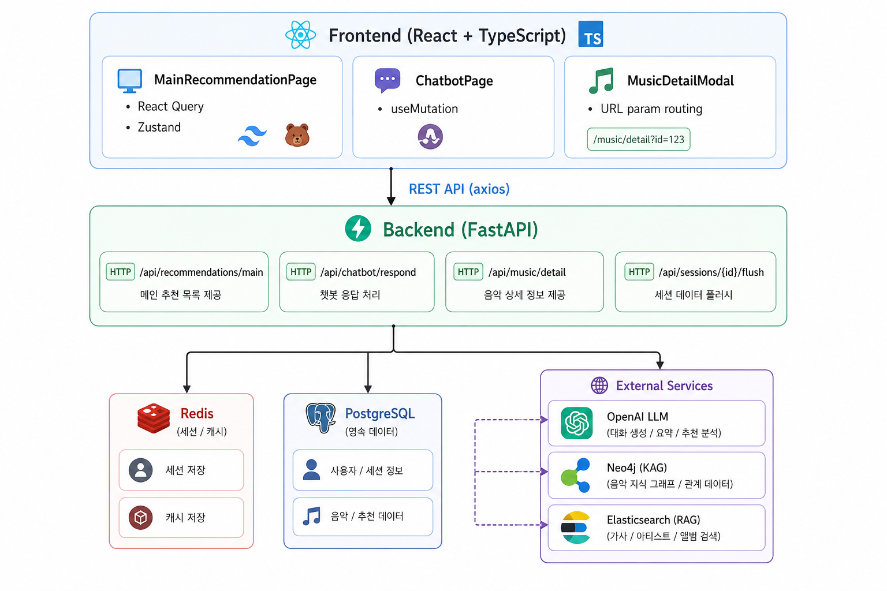
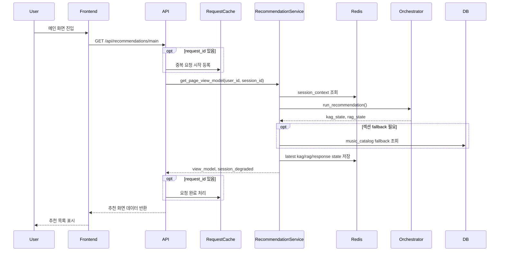
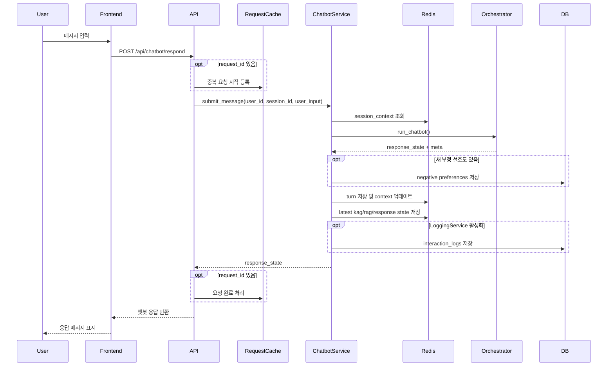
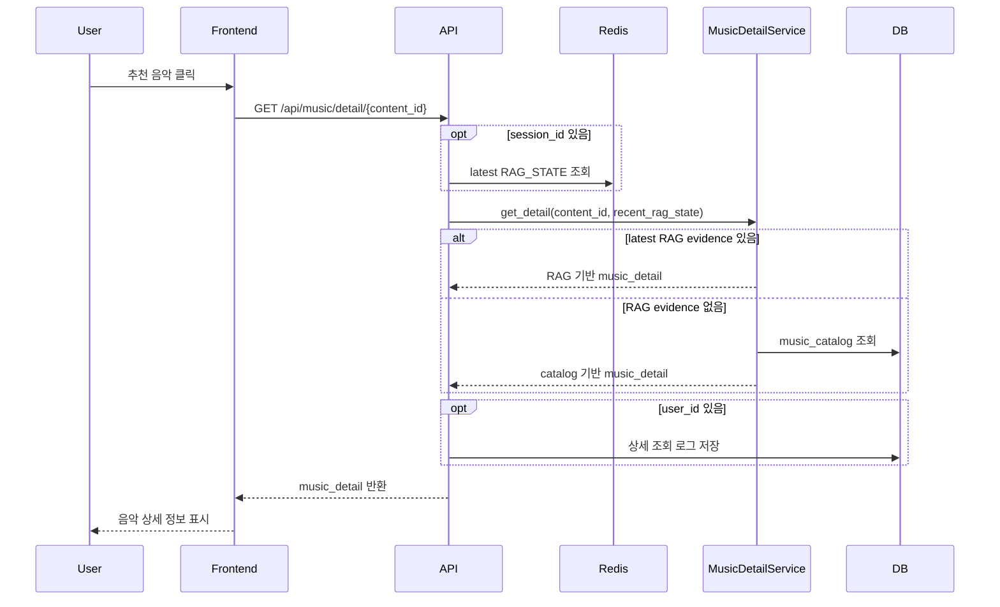

# RIMAS

**RIMAS (Recommendation Intelligence Music Assistant System)**는 Multi-Agent AI 기반 음악 큐레이터 시스템입니다. 사용자의 취향을 분석하고 그래프 탐색(KAG)과 의미 검색(RAG)을 결합하여 개인화된 음악을 추천하며, 자연어 챗봇으로 음악 대화를 지원합니다.

---
## 팀 소개

### 팀 명: 테일즈비트

|  |  |  |  |  |
| :---: | :---: | :---: | :---: | :---: | 
| **이혜림(팀장)** | **김경수** | **이성진** | &emsp;**이재건**&emsp; | &emsp;**김경호**&emsp; |  
| 프론트엔드, <br>DB, LLM| KAGneo4j <br>연결 및 관리| KAG데이터 <br>라벨링 및 구조 | RAG 총괄 | RAG |


---

## 요구사항 정의서

### 프로젝트 배경 및 목표

기존 음악 스트리밍 서비스의 추천 시스템은 단순 이력 기반 필터링에 의존하여 취향의 다양성과 맥락을 충분히 반영하지 못합니다. RIMAS는 그래프 기반 관계 탐색(KAG), 의미 기반 증거 검색(RAG), LLM 자연어 생성을 결합한 Multi-Agent 구조로 이 한계를 극복합니다.

**목표**: 사용자 취향과 맥락을 이해하는 개인화 음악 추천 + 자연어 대화 기반 음악 큐레이션 서비스 제공

---

### 기능 요구사항 (Functional Requirements)

| ID | 기능 | 설명 |
|----|------|------|
| FR-01 | 개인화 음악 추천 | 사용자 취향 프로파일과 그래프 관계 기반으로 3개 섹션(개인화·탐색·신규) 추천 제공 |
| FR-02 | 자연어 챗봇 대화 | 사용자 자연어 입력을 분석하여 의도에 맞는 음악 추천 및 설명 응답 생성 |
| FR-03 | 챗봇 스트리밍 응답 | SSE(Server-Sent Events) 기반 실시간 응답 스트리밍 — delta/final/done 이벤트 순서로 전송 |
| FR-04 | 음악 상세 정보 조회 | 추천 카드 클릭 시 RAG 증거 기반 음악 상세 정보(장르·분위기·추천 이유) 제공 |
| FR-05 | 세션 히스토리 관리 | 대화 히스토리와 세션 컨텍스트를 Redis에 보관하고 세션 수명 동안 유지 |
| FR-06 | 세션 영속화 | Redis 세션 데이터를 PostgreSQL로 플러시하여 영구 보관 |
| FR-07 | 취향 피드백 | 추천 카드 "취향 추가" 버튼으로 genre·mood·artist를 SESSION_CONTEXT에 반영, taste event Redis 누적 후 flush 시 영속화 |
| FR-08 | 취향 배지 표시 | SESSION_CONTEXT의 mood·genre 태그를 헤더 배지로 시각화 |
| FR-09 | 음악 상세 URL 공유 | `?detail={content_id}` 파라미터로 상세 모달 직접 링크 지원 |

---

### 비기능 요구사항 (Non-Functional Requirements)

| ID | 분류 | 요구사항 |
|----|------|---------|
| NFR-01 | 가용성 | Redis 장애 시에도 추천 흐름을 계속 진행하고 `session_degraded` 플래그로 프론트에 통보 |
| NFR-02 | 멱등성 | `request_id` 기반 중복 요청 차단 — 같은 요청의 재시도는 동일 ID를 재사용하고 백엔드가 409로 차단 |
| NFR-03 | 복원력 | LLM(InputPlanner) 실패 시 rule-based fallback 자동 전환, 추천 흐름 중단 없음 |
| NFR-04 | 안전성 | `prod` 환경에서 필수 환경 변수 누락 시 서버 시작 즉시 실패(fail-fast) |
| NFR-05 | 정보 보호 | 내부 Agent trace·validator trace는 API 응답에 미노출, 외부에 보이지 않음 |
| NFR-06 | 추천 품질 | 추천 결과는 최대 5곡으로 제한하여 집중도 있는 큐레이션 제공 |
| NFR-07 | 성능 | React Query stale-time 및 마운트 단위 requestId로 불필요한 중복 API 호출 방지 |
| NFR-08 | 확장성 | Mock Adapter를 통한 전체 흐름 검증 — Real Neo4j / Elasticsearch 교체 없이 독립 동작 가능 |

---

## 기능 설계서

### 시스템 아키텍처



---

### Agent 파이프라인 설계

Multi-Agent 오케스트레이터가 각 Agent를 순차 실행합니다.

```
사용자 요청
    │
    ▼
InputPlannerAgent
  - 사용자 의도 분류 (primary_goal / mood / genre / era 등)
  - LLM(OpenAI) 우선 → 실패 시 rule-based fallback
    │
    ▼
KagDispatchAgent
  - 그래프 탐색으로 추천 방향 및 후보 content_id 결정
  - KAG_STATE 생성 (route / target_section / recommended_content_ids)
    │
    ▼
ContractValidator
  - KAG_STATE + SESSION_CONTEXT 계약(enum) 검증
  - 타입·필드 위반 시 경고 로그 (흐름은 계속)
    │
    ▼
RagDispatchAgent
  - 후보 content_id에 대한 의미 기반 증거 검색
  - RAG_STATE 생성 (evidence_summary / recommendation_reason)
    │
    ▼
IntentAgent  [챗봇 전용]
  - KAG + RAG 결과 기반 최종 intent 결정
    │
    ▼
RecommendationAgent
  - 최종 추천 후보 선택 (최대 5곡)
  - 랭킹 점수 = max(0.1, 1.0 − (rank−1) × 0.05)
    │
    ▼
ResponseGenerator
  - LLM으로 추천 이유 자연어 응답 생성
  - API 키 없으면 로컬 템플릿 응답 반환
    │
    ▼
ResponseValidator + ProvenanceValidator
  - 응답 품질 검증 (형식 / 출처 일관성)
    │
    ▼
최종 응답 반환
```

---

### 핵심 AI 기술 구현 상세

RIMAS는 단순히 LLM에 추천을 맡기는 구조가 아니라, **KAG 후보 생성 → RAG 근거 검색 → LLM 응답 생성 → Validator 검증**으로 역할을 분리했습니다. 각 단계는 JSON 계약을 통해 연결되며, 외부 시스템 장애나 API 키 누락 시에도 fallback 경로로 동작하도록 설계했습니다.

#### KAG: Knowledge Augmented Generation / Graph 기반 후보 탐색

KAG 계층은 사용자 입력과 세션 취향을 그래프 탐색 조건으로 바꿔 **추천 후보 `content_id` 목록**을 만드는 역할입니다.

| 항목 | 구현 내용 |
|------|----------|
| 진입점 | `KagDispatchAgent` |
| Adapter | `MockKagAdapter`, `RealKagAdapter` |
| Real 연결 | `RIMAS_KAG_MODE=real`이면 Neo4j 기반 `RealKagAdapter` 사용 |
| 입력 | `KAG_INPUT_JSON` + `SESSION_CONTEXT` |
| 출력 | `KAG_STATE` (`recommended_content_ids`, `recommendation_category`, `route`, `target_section`, `matched_nodes`, `excluded_nodes`) |
| 핵심 처리 | 장르, 분위기, 상황, 날씨, 최근 취향을 조건으로 Neo4j query key와 parameter를 결정 |
| 품질 제어 | `requested_count` 기반 후보 수 제한, 부정 선호 아티스트/트랙 제외, 중복 `content_id` 제거 |

`InputPlannerAgent`가 사용자 입력을 먼저 `intent_type`, `detected_genres`, `detected_moods`, `requested_count`, `disliked_artists` 등으로 정규화하고, 이 값을 `KAG_INPUT_JSON.constraints`에 전달합니다. KAG는 이 조건을 바탕으로 Neo4j에서 후보 곡을 찾고, 이후 RAG가 사용할 수 있도록 후보 `content_id` 범위를 좁힙니다.

Real KAG는 다음과 같은 기준으로 탐색합니다.

- 조건이 2개 이상이면 복합 조건 쿼리 사용
- 장르 조건이 있으면 장르 기반 추천 쿼리 사용
- 상황/날씨 조건이 있으면 상황/날씨 기반 쿼리 사용
- 조건이 부족하면 기본 탐색 쿼리 사용
- 결과 row는 `content_id`, `title`, `artist`, `genre`, `score` 등으로 정규화

#### RAG: Retrieval Augmented Generation / Elasticsearch 기반 근거 검색

RAG 계층은 KAG가 만든 후보 안에서만 근거를 검색합니다. 즉, 검색 결과가 아무 곡이나 추천하지 못하도록 **KAG 후보 `content_id` 범위로 retrieval을 제한**합니다.

| 항목 | 구현 내용 |
|------|----------|
| 진입점 | `RagDispatchAgent` |
| Adapter | `MockRagAdapter`, `RealRagAdapter` |
| Real 연결 | `RIMAS_RAG_MODE=real`이면 Elasticsearch 기반 `RealRagAdapter` 사용 |
| 입력 | `KAG_STATE` + `RAG_INPUT_JSON` |
| 출력 | `RAG_STATE` (`recommended_content_evidence`, `recommendation_reason`, `retrieval_metadata`, `retrieval_trace`) |
| 검색 방식 | `content_id` terms filter + `multi_match` should query |
| 검색 필드 | `content`, `text`, `metadata.track_name`, `metadata.artist`, `metadata.genre`, `metadata.emotion` 등 |
| 안정성 | KAG 후보 밖 hit 제거, 부정 선호 artist/track 제거, 검색 실패 시 `failed`, 후보 없음/근거 없음 시 `fallback` |

Real RAG는 Elasticsearch hit를 `ElasticsearchRagHit`으로 매핑한 뒤, RAG_STATE의 `recommended_content_evidence`로 변환합니다. 이 evidence에는 사용자에게 직접 보여줄 수 있는 최소 메타데이터와 검색 근거가 들어갑니다.

RAG가 만드는 주요 evidence 필드는 다음과 같습니다.

- `content_id`
- `title`
- `artist`
- `album`
- `genre`
- `mood`
- `evidence_summary`
- `release_type`
- `recommendation_category`
- `retrieval_score`

이 구조 덕분에 LLM은 곡을 새로 만들지 않고, 이미 KAG/RAG가 확정한 후보와 근거 안에서만 설명을 생성합니다.

#### LLM: 입력 이해와 응답 생성

LLM은 두 군데에서 선택적으로 사용합니다. API 키가 없거나 호출에 실패하면 rule-based 또는 local fallback으로 전환합니다.

| 사용 위치 | 역할 | 실패 시 처리 |
|----------|------|-------------|
| `InputPlannerAgent` | 사용자 자연어를 `INTENT_STATE`, `KAG_INPUT_JSON`으로 구조화 | rule-based parser로 자동 전환 |
| `ResponseGenerator` | 선택된 추천 결과를 자연어 챗봇 응답 JSON으로 생성 | local template 응답 또는 orchestrator fallback |

LLM Input Planner는 OpenAI Responses API의 `json_schema` strict mode를 사용해 출력 형식을 강제합니다. 출력값은 다시 코드에서 검증합니다.

- 허용된 intent enum만 사용
- 허용된 mood/genre/situation만 통과
- `requested_count`는 1 이상, 최대 추천 수 이하로 제한
- 부정 선호는 `disliked_artists`, `disliked_tracks`로 분리

ResponseGenerator는 다음 원칙을 지킵니다.

- RAG_STATE에 없는 곡, 아티스트, 장르를 새로 만들지 않음
- 내부 trace, selected_path, raw JSON을 사용자 응답에 노출하지 않음
- `ResponseState` JSON schema로만 응답
- LLM 결과는 `ResponseValidator`, `ProvenanceValidator`, `DisplayReasonValidator`를 통과해야 사용자에게 노출
- raw `evidence_summary`를 그대로 추천 이유로 복사하지 않고, 메타데이터 기반의 짧은 설명으로 정제

이 구조는 발표 관점에서 다음 학습 포인트를 보여줍니다.

- 그래프 DB를 사용해 후보군을 좁히는 KAG 설계
- 검색 엔진을 사용해 후보별 설명 근거를 붙이는 RAG 설계
- LLM을 “추천 생성기”가 아니라 “구조화/표현 생성기”로 제한하는 안전한 사용 방식
- JSON schema, Pydantic schema, Validator를 이용한 hallucination 억제
- Mock Adapter와 Real Adapter를 같은 계약으로 교체하는 확장 구조

---

### 기능별 상세 설계

#### 메인 추천 페이지

| 구성요소 | 설계 |
|---------|------|
| 추천 섹션 | 전체 추천 화면에서는 개인화 추천 / 새로운 취향 탐색 / 신규 발매 3개 섹션을 함께 표시 |
| 카테고리 진입 | 홈 별자리 노드에서 개인화 추천 / 새로운 취향 / 신규 발매를 선택하면 해당 카테고리 섹션만 표시 |
| 취향 배지 | SESSION_CONTEXT의 mood·genre 태그를 헤더에 배지로 표시 |
| 오늘의 테마 | 날짜·취향 기반 테마 메시지 |
| 캐릭터 DJ 배너 | Agent 추천 메시지 표시, 챗봇으로 이동 버튼 |
| 상태 관리 | React Query (staleTime 5분) + `useRequestId()` 훅으로 retry 시 동일 ID 재사용 |
| session_degraded | Redis 장애 시 경고 배너 상단 노출 |

#### 챗봇 페이지

| 구성요소 | 설계 |
|---------|------|
| 메시지 전송 | SSE 스트리밍 — `sendChatMessageStream()` async generator로 delta 수신, `streamingRef`로 중복 전송 차단 |
| 스트리밍 상태 머신 | `appendUserTurn` → `appendAssistantDelta` (delta 누적) → `finalizeAssistantTurn` (display_recommendations 주입) |
| 히스토리 로드 | 마운트 1회 `useQuery` — Redis 세션 히스토리 조회 |
| 자동 스크롤 | history 변경마다 하단 자동 스크롤 |
| 관련 추천 카드 | 마지막 챗봇 응답의 `display_recommendations`를 카드로 표시, "취향 추가" 클릭 시 `/api/taste` 호출 |
| 세션 종료 모달 | 히스토리가 있을 때 홈 이동 클릭 시 저장/미저장 선택 모달 표시, 저장 시 `/api/sessions/{id}/flush` 호출 |
| request_id | 전송마다 `generateRequestId()`로 새 ID 생성 |

#### 음악 상세 모달

| 구성요소 | 설계 |
|---------|------|
| 데이터 소스 우선순위 | 1순위: 최근 RAG_STATE evidence / 2순위: music_catalog / 3순위: minimal metadata |
| URL 연동 | `?detail={content_id}` — pushState로 딥링크·뒤로가기 지원 |
| request_id | `useRequestIdPerKey(contentId)` — 곡 변경 시 새 ID, 같은 곡 retry는 동일 ID |
| view log | `user_id` 있을 때 interaction_logs에 비동기 저장 |

---

### 데이터 설계

#### Redis 세션 구조 (세션당 주요 키)

| 키 | 용도 | TTL |
|----|------|-----|
| `rimas:session:{id}:history` | 대화 히스토리 list (최대 50턴) | 세션 TTL |
| `rimas:session:{id}:context` | SESSION_CONTEXT JSON | 세션 TTL |
| `rimas:session:{id}:latest:kag_state` | 최근 KAG_STATE | 세션 TTL |
| `rimas:session:{id}:latest:rag_state` | 최근 RAG_STATE | 세션 TTL |
| `rimas:session:{id}:latest:response_state` | 최근 RESPONSE_STATE | 세션 TTL |
| `rimas:session:{id}:recommendation:metadata` | 추천 메타데이터 | 세션 TTL |
| `rimas:session:{id}:taste_events` | 취향 추가 이벤트 누적 list | 세션 TTL |

#### PostgreSQL 주요 테이블

| 테이블 | 용도 |
|--------|------|
| `users` | 사용자 기본 정보 |
| `music_catalog` | 음악 메타데이터 (title, artist, genre, mood, release_date) |
| `interaction_logs` | KAG/RAG/Response state 압축 로그, view log, latency |
| `chat_sessions` | 세션 메타데이터 (flush 시 upsert) |
| `chat_session_turns` | 대화 turn 영속 기록 |
| `user_taste_events` | 명시적 취향 추가 이벤트 영속 기록 |
| `user_taste_profiles` | 사용자별 긍정 취향 요약 |
| `user_negative_preferences` | 사용자별 부정 선호도 요약 |

---

### Frontend 아키텍처

```
src/
  pages/        MainRecommendationPage, ChatbotPage
  components/   home/ · recommendation/ · chatbot/ · background/ · mascot/ — 페이지/역할 단위 컴포넌트 분리
  api/          chatbot · recommendation · musicDetailApi — axios 래퍼
  stores/       chatStore (Zustand) · sessionStore — 전역 상태
  hooks/        useRequestId · useRequestIdPerKey — requestId 훅
  utils/        generateRequestId — crypto.randomUUID 기반 ID 생성
  types/        API 응답 TypeScript 타입 (session_degraded 포함)
```

**상태 관리 전략**
- API 서버 상태: React Query (`useQuery` / `useMutation`)
- 챗봇 히스토리: Zustand chatStore (`appendTurn`으로 낙관적 업데이트)
- 입력값: 지역 `useState` — 타이핑마다 전역 재렌더 방지

---

## 기술 스택

| 구분 | 기술 |
|------|------|
| Backend | Python 3.12+, FastAPI |
| Frontend | React, TypeScript, Vite |
| Cache | Redis |
| Database | PostgreSQL |
| LLM | OpenAI GPT-4.1-mini (optional) |
| Graph DB | Neo4j (Real KAG Adapter 연동) |
| Search | Elasticsearch (Real RAG Adapter 연동) |
| 상태 관리 | React Query, Zustand |
| 컨테이너 | Docker Compose |

---

## 보조 동작 흐름

### Taste Feedback

```text
추천 카드 "취향 추가" 클릭
-> POST /api/taste/events  { user_id, session_id, content_id, request_id }
-> TasteEventService.add_to_taste
   -> MusicDetailService로 곡 genre·mood·artist 조회
   -> SESSION_CONTEXT 즉시 갱신 (recent_genres, recent_moods, recent_artists, selected_tracks)
   -> Redis에 taste event 누적 (rimas:session:{id}:taste_events)
-> Response: { status, session_context }

세션 종료 (flush) 시
-> session_flush_service → taste_events → PostgreSQL taste_profiles upsert
-> Redis taste_events 키 삭제
```

### Session Flush

```text
POST /api/sessions/{session_id}/flush?user_id=&flush_logs=false
-> session_history_cache.get_history (Redis)
-> PostgreSQL: chat_sessions upsert + chat_session_turns insert
-> (flush_logs=true, local/dev 환경만) interaction_logs DELETE WHERE session_id=?
-> session_history_cache.clear_session (Redis history + context)
-> latest_state_cache.clear_latest_states (Redis latest kag/rag/response/metadata)
-> Response: { session_id, flushed, logs_deleted }
```

---

## UI/UX 동작 시퀀스

### 페이지 진입 동작



### 챗봇 입력 동작



### 음악 상세 조회 동작



---

## API 엔드포인트

| Method | Path | 설명 |
|--------|------|------|
| GET | `/health` | 서버 상태 확인 |
| GET | `/api/recommendations/main` | 메인 추천 페이지 뷰모델 |
| POST | `/api/chatbot/respond` | 챗봇 메시지 처리 (일반 응답) |
| POST | `/api/chatbot/respond/stream` | 챗봇 메시지 처리 — SSE 스트리밍 (delta / final / done) |
| GET | `/api/sessions/{session_id}/history` | Redis 세션 히스토리 |
| POST | `/api/sessions/{session_id}/flush` | Redis → PostgreSQL 플러시 (taste events 포함) |
| DELETE | `/api/sessions/{session_id}` | Redis 세션 삭제 |
| GET | `/api/music/detail/{content_id}` | 음악 상세 뷰모델 |
| POST | `/api/taste/events` | 추천 곡을 취향에 추가 — SESSION_CONTEXT 즉시 반영, taste event Redis 누적 |

---

## 구현 현황

### 완료

| 구분 | 내용 |
|------|------|
| 챗봇 스트리밍 | SSE 기반 — `POST /api/chatbot/respond/stream`, `ChatbotStreamService`, 12자 청크 분할 전송 |
| Redis 세션 | history, context, latest kag/rag/response state, recommendation metadata, taste events |
| Session flush | Redis → PostgreSQL (chat_sessions, chat_session_turns, taste_profiles), flush 후 Redis 6개 키 전체 삭제 |
| Taste 피드백 | `/api/taste/events` — 곡 추가 시 SESSION_CONTEXT 즉시 갱신 + taste event Redis 누적 → flush 시 PostgreSQL 영속화 |
| 부정 선호도 | 챗봇 대화에서 "싫어"/"빼줘" 감지 → NegativePreferenceService → PostgreSQL 저장 + SESSION_CONTEXT 반영 |
| 세션 컨텍스트 수화 | 세션 cold-start 시 taste_profile → SESSION_CONTEXT 자동 로드 (SessionContextHydrationService) |
| flush_logs | `flush_logs=true` — local/dev 전용, session_id 기준 interaction_logs 삭제 |
| session_degraded | Redis 장애 시 응답 최상위에 플래그, 추천 흐름은 계속 진행 |
| Music Detail | latest RAG_STATE 연결 (session_id), music_catalog fallback, view log 저장 (user_id) |
| prod fail-fast | 필수 env 누락 시 서버 시작 즉시 실패 |
| Frontend | 홈 별자리 네비게이션(cosmos 컴포넌트), 메인 추천 3섹션, 챗봇 스트리밍 UI, 음악 상세 모달, 세션 종료 모달 |
| Frontend 상태 관리 | chatStore 스트리밍 상태 머신, sessionStore, themeStore, `generateRequestId` 유틸 |
| 중복 요청 차단 | `request_lifecycle_cache` — request_id 기반 409 차단, `streamingRef`로 프론트 이중 전송 방지 |

---

## 실행

`.env.example`을 기준으로 로컬 `.env`를 만든 뒤 실행합니다.

```env
RIMAS_DB_NAME=rimas
RIMAS_DB_USER=rimas
RIMAS_DB_PASSWORD=change_me_postgres_password
RIMAS_NEO4J_USER=neo4j
RIMAS_NEO4J_PASSWORD=change_me_neo4j_password
OPENAI_API_KEY=
RIMAS_KAG_MODE=real
RIMAS_RAG_MODE=real
RIMAS_ELASTICSEARCH_INDEX=spotify_songs
```

`.env`는 Git에 커밋하지 않습니다. `OPENAI_API_KEY`가 비어 있으면 챗봇 응답 생성은 로컬 fallback 문구를 사용합니다.

```powershell
docker compose down -v
docker compose up --build
```

서비스 확인:

```
Frontend:                   http://localhost:5173
Backend health:             http://localhost:8000/health
API 문서 (Swagger UI):       http://localhost:8000/docs
Main Recommendation API:    http://localhost:8000/api/recommendations/main?user_id=user_001&session_id=session_001
Chatbot stream test:        POST http://localhost:8000/api/chatbot/respond/stream
Neo4j Browser:              http://localhost:7474
Elasticsearch:              http://localhost:9200
```

Redis 세션 확인 (Docker 내부):

```powershell
docker exec -it rimas-redis redis-cli
# 세션 키 목록
KEYS rimas:session:session_001:*
# 세션 컨텍스트 확인
GET rimas:session:session_001:context
# 대화 히스토리 확인 (최신 순)
LRANGE rimas:session:session_001:history 0 -1
# taste event 확인
LRANGE rimas:session:session_001:taste_events 0 -1
```

---

## 주요 폴더

```text
app/
  agents/          Orchestrator, InputPlanner, KAG/RAG Dispatch, Intent, Recommendation, ResponseGenerator, ValidatorController
  api/             FastAPI routes — chatbot (일반+스트리밍), recommendation, session, music, taste
  cache/           Redis 클라이언트, redis_keys, session_history_cache, latest_state_cache
  common/          constants (ALLOWED_MOODS/GENRES 등 enum), default_state (fallback), labels
  config/          settings.py (환경 변수 로드, prod fail-fast)
  contracts/       KagStateField, RagStateField, SessionContextField enum
  core/            logging_config, LoggingMiddleware
  json_templates/  Agent 간 계약 JSON 스키마 파일
  kag/             KAG 연결·쿼리·adapters (Mock / Real Neo4j)
  llm/             OpenAI LLM 클라이언트, response_state_schema
  policies/        RecommendationPolicy, RankingPolicy (Python)
  prompts/         LLM 프롬프트 — InputPlanner용 system prompt + JSON schema
  rag/             RAG adapters (Mock / Real Elasticsearch), services, builders, validators
  repositories/    BaseRepository, query_constants, PostgreSQL 레포지토리 8개
  schemas/         Pydantic 스키마 — intent, kag_input, kag_state, rag_input, rag_state, response_state, session_context, music_detail
  services/        비즈니스 서비스 — chatbot, chatbot_stream, main_recommendation,
                   session_cache, session_flush, session_context_hydration,
                   logging, taste_event, negative_preference, music_detail,
                   compact_state_builder, request_lifecycle_cache
  validators/      BaseValidator, ContractValidator, ResponseValidator, ProvenanceValidator, DisplayReasonValidator

frontend/src/
  api/             chatbot (일반+스트리밍+flush), recommendation, musicDetailApi, taste
  components/
    background/    DreamBackground, SoftGlowLayer, StaticStarLayer
    chatbot/       ChatbotHeader, ChatHistory, ChatInput, RelatedRecommendationCards
    cosmos/        CenterMascotOrb, ConstellationLines, CosmicBackground, FloatingParticles, GlowRing, OrbitNode, StarField
    home/          ConstellationHome
    mascot/        MascotCharacter
    recommendation/ CharacterDjBanner, MusicDetailModal, RecommendationCard, RecommendationSection, TopTasteHeader
    ui/            DreamButton, GlassPanel
  hooks/           useRequestId
  pages/           Home, MainRecommendationPage, ChatbotPage
  stores/          chatStore (스트리밍 상태 머신), sessionStore, themeStore
  styles/          theme, motion
  types/           API 응답 TypeScript 타입 전체
  utils/           generateRequestId (crypto.randomUUID)

docs/
  policies/        RecommendationPolicy, RankingPolicy, PromptPolicy
  rimas_v_4_integrated_design_updated_final_.md
```

---

## 정책 문서

- [RecommendationPolicy](docs/policies/RecommendationPolicy.md) — 카테고리 우선순위, 최대 추천 수
- [RankingPolicy](docs/policies/RankingPolicy.md) — 점수 계산 공식
- [PromptPolicy](docs/policies/PromptPolicy.md) — LLM 적용 범위, enum 검증, fallback 정책

---

## 개발 후기 

 - 이혜림님 개발 후기 
 - 이재건님 개발 후기 https://github.com/SKNETWORKS-FAMILY-AICAMP/SKN27-3rd-2TEAM/issues/42
 - 이성진님 개발 후기 https://github.com/SKNETWORKS-FAMILY-AICAMP/SKN27-3rd-2TEAM/issues/43
 - 김경수님 개발 후기 https://github.com/SKNETWORKS-FAMILY-AICAMP/SKN27-3rd-2TEAM/issues/38
 - 김경호님 개발 후기 
