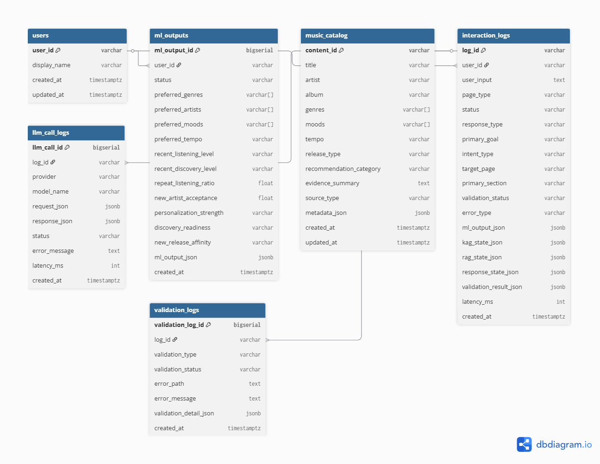

# RIMAS

Personalized Music Recommendation + Curator-Based Expansion Architecture

RIMAS v2는 기존 사용자 기반 개인화 추천을 유지하면서, 최신 업데이트 음악 추천, 새로운 취향 탐색, 음악/아티스트/장르 정보 제공, LLM 기반 큐레이터형 설명을 확장하는 음악 추천 시스템입니다.

## 핵심 원칙

- ML은 사용자 상태와 취향 기반 입력 정보를 제공합니다.
- KAG는 사용자 기반 추천 방향과 큐레이션 경로를 결정합니다.
- RAG는 추천 후보와 설명 근거를 제공합니다.
- LLM은 추천 후보를 새로 만들지 않고, 사용자에게 전달할 큐레이터형 자연어 응답만 생성합니다.
- 추천과 설명의 근거는 반드시 `KAG_STATE`, `RAG_STATE`, `ML Output` 기반으로 제한합니다.
- UI는 Service만 호출하며, SQL 실행이나 LLM 직접 호출을 수행하지 않습니다.
- `ML Output`, `KAG_STATE`, `RAG_STATE` 원본은 수정하지 않습니다.
- Contract Validation 실패 시 LLM을 실행하지 않습니다.
- Response Validation 또는 Provenance Validation 실패 시 fallback으로 전환합니다.
- PostgreSQL에 성공, 실패, fallback 로그를 저장합니다.
- Mock Adapter에서 Real Adapter로 교체 가능한 구조를 유지합니다.

## ERD



## 전체 시스템 흐름

### Main Recommendation Page

```text
Page Entry
-> selected_user_id 확인
-> ML Output 조회
-> KAG_STATE 생성 또는 수신
-> RAG_STATE 생성 또는 수신
-> Contract Validation
-> Recommendation View Model 생성
-> Main Recommendation Page 출력
-> interaction_logs 저장
```

### Chatbot Page

```text
User Input
-> selected_user_id 확인
-> ML Output 조회
-> KAG_STATE 생성 또는 수신
-> RAG_STATE 생성 또는 수신
-> Contract Validation
-> Intent Agent
-> Curation Agent
-> Recommendation Agent
-> Response Generator
-> Response Validation
-> Provenance Validation
-> interaction_logs 저장
-> Chatbot Page 출력
```

## 시스템 레이어

| Layer | 책임 | 금지 사항 |
| --- | --- | --- |
| UI | 사용자 입력, 추천 카드, 챗봇 응답, 개인화 안내 표시 | SQL 실행, ML/KAG/RAG 수정, 추천 생성, LLM 직접 호출 |
| Service | 전체 실행 흐름 제어, Repository/Adapter/Validator/Agent 조합, 로그 저장 | JSON 계약 임의 변경, Validation 실패 무시, UI 렌더링 |
| Repository | PostgreSQL 조회/저장, ML Output 조회, interaction_logs 저장 | 비즈니스 판단, LLM 호출, UI 의존, SQL 하드코딩 |
| Adapter | KAG_STATE/RAG_STATE 반환, Mock/Real 구현체 분리 | Service Layer 변경을 요구하는 구현체 결합 |
| Validator | Contract, Response, Provenance 검증 | 검증 실패 무시 |
| Agent | Intent, Curation, Recommendation, Response 생성 흐름 담당 | 근거 없는 추천 생성, 내부 코드명 노출 |

## DB 기준

DB는 PostgreSQL 기준으로 설계합니다.

필수 테이블:

- `users`
- `ml_outputs`
- `music_catalog`
- `interaction_logs`

선택 테이블:

- `llm_call_logs`
- `validation_logs`

`ML Output`, `KAG_STATE`, `RAG_STATE`, `RESPONSE_STATE`는 JSONB로 원본을 보존합니다. `interaction_logs`는 append-only 방식으로 저장합니다.

## 프로젝트 구조

```text
app/
  main.py
  common/
  pages/
  ui/
    components/
    styles/
  services/
  agents/
    prompts/
  adapters/
  kag/
    README.md
  rag/
    README.md
  validators/
  repositories/
  schemas/
  contracts/
  json_templates/
  config/
docs/
tests/
```

## Common constants and state

Current contract ownership:

- `app/common/enums.py`: common `status` enum
- `app/common/constants.py`: `DEFAULT_USER_ID`, enum-based common `status` values
- `app/common/default_state.py`: `SESSION_DEFAULTS`, `DEFAULT_ML_OUTPUT`, `FALLBACK_RESPONSE_STATE`
- `app/common/labels.py`: recommendation category display labels
- `app/contracts/fields.py`: JSON input/output field enums
- `app/contracts/enums.py`: contract value enums
- `app/json_templates/`: JSON template examples

공통 계약 상수와 기본 state는 `app/common/`에서 관리합니다.

- `app/common/constants.py`: `DEFAULT_USER_ID`, 공통 `status` 허용값
- `app/common/default_state.py`: `SESSION_DEFAULTS`, `DEFAULT_ML_OUTPUT`, `FALLBACK_RESPONSE_STATE`
- `app/common/labels.py`: 추천 category 표시 label

레이어 책임이 명확한 상수는 기존 위치를 유지합니다.

- SQL 쿼리 상수는 Repository Layer 책임이므로 `app/repositories/query_constants.py`에 둡니다.
- UI 색상, spacing, radius 같은 theme 상수는 UI Layer 책임이므로 `app/ui/styles/theme.py`에 둡니다.

## KAG/RAG 업로드 구조

KAG와 RAG의 실제 구현 업로드와 검토를 쉽게 하기 위해 다음 폴더를 분리했습니다.

- `app/kag/`: KAG 관련 구현 파일을 배치할 패키지
- `app/rag/`: RAG 관련 구현 파일을 배치할 패키지

각 폴더는 Python 패키지로 import 가능하도록 `__init__.py`를 포함합니다.
기존 Service Layer는 `app.adapters`의 `KagAdapter`, `RagAdapter`, Mock/Real Adapter 경계를 통해 KAG/RAG를 호출하는 구조를 유지합니다.
향후 `RealKagAdapter`, `RealRagAdapter`에서 `app.kag`, `app.rag` 내부 구현을 연결하더라도 Service Layer import 경로를 직접 변경하지 않는 방향이 기본 원칙입니다.

각 폴더의 README는 기존 설계 문서 기준 기능정의서입니다.

- `app/kag/README.md`: KAG 역할, 입력/출력, 계층 관계, 제한 사항, 검증 기준
- `app/rag/README.md`: RAG 역할, 입력/출력, evidence/provenance 기준, 제한 사항, 검증 기준

KAG/RAG 책임 분리는 다음 기준을 따릅니다.

- KAG는 사용자 상태, 사용자 입력, ML Output을 기반으로 추천 방향과 큐레이션 경로를 결정합니다.
- RAG는 KAG_STATE가 결정한 방향에 맞춰 추천 후보, 추천 근거, 음악 정보 설명 근거를 제공합니다.
- LLM은 추천 후보를 새로 만들지 않고 KAG/RAG/ML 근거 안에서 자연어 응답만 생성합니다.
- UI는 Service Layer가 만든 View Model을 표시하며 KAG/RAG 원본을 수정하지 않습니다.

## 구현 순서 원칙

`docs/WBS v2.md` 기준 구현 순서는 다음을 따릅니다.

1. 계약 먼저: Schema
2. 데이터 먼저: DB + Mock
3. 흐름 먼저: Service
4. 검증 먼저: Validator
5. 그 다음 LLM
6. 마지막 UI

금지:

- UI 먼저 만들기
- LLM 먼저 붙이기
- Schema 없이 구현하기

## 설계 문서

- [Design.md](docs/Design.md)
- [Service Flow 설계.md](docs/Service%20Flow%20설계.md)
- [DB Schema 상세 설계.md](docs/DB%20Schema%20상세%20설계.md)
- [JSON Schema  Pydantic Schem.md](docs/JSON%20Schema%20%20Pydantic%20Schem.md)
- [Common Constants State.md](docs/Common%20Constants%20State.md)
- [Agent Prompt 상세 설계.md](docs/Agent%20Prompt%20상세%20설계.md)
- [WBS v2.md](docs/WBS%20v2.md)
