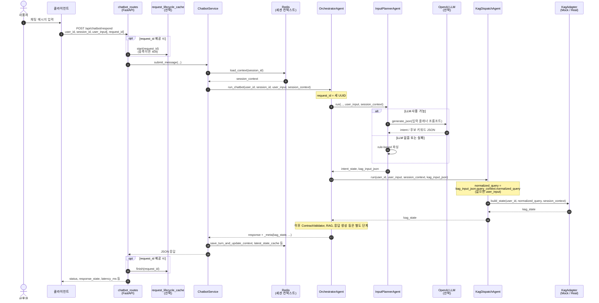

# 사용자 채팅 입력 → KAG 검색(상태 생성) 요청까지 처리 흐름

이 문서는 FastAPI 챗봇 API에서 사용자 메시지가 들어온 뒤, **KAG(Knowledge-Augmented Graph) 측에서 추천 방향·후보 트랙 등을 담은 `kag_state`를 만들기 위해 어댑터가 호출되기까지**의 경로를 정리한다.

구현 기준 시점: `OrchestratorAgent.run_chatbot` 내부에서 `KagDispatchAgent.run` → `KagAdapter.build_state` 순으로 실행된다.

---

## 1. 단계 요약

| 순서 | 구성 요소 | 역할 |
|------|-----------|------|
| 1 | `POST /api/chatbot/respond` (`app/api/chatbot_routes.py`, `app/main.py`에서 prefix 마운트) | `ChatRequest` 수신. 선택적 `request_id`로 중복 요청(409) 차단. |
| 2 | `ChatbotService.submit_message` (`app/services/chatbot_service.py`) | 세션 컨텍스트 로드 후 오케스트레이터 실행. |
| 3 | `session_cache_service.load_context` | Redis에서 `SESSION_CONTEXT` 로드(miss 시 빈 컨텍스트). |
| 4 | `OrchestratorAgent.run_chatbot` (`app/agents/orchestrator_agent.py`) | `request_id` 발급 → 입력 정규화 → **KAG 디스패치**. |
| 5 | `InputPlannerAgent.run` (`app/agents/input_planner_agent.py`) | `user_input` + `session_context` → `intent_state`, **`kag_input_json`**. |
| 6 | `KagDispatchAgent.run` (`app/agents/kag_dispatch_agent.py`) | 정규화된 쿼리 문자열 확정 후 **`KagAdapter.build_state` 호출**. |
| 7 | `MockKagAdapter` / `RealKagAdapter` (`app/kag/adapters/`) | 그래프·룰 등으로 **`kag_state` dict 생성**(현재 기본은 Mock). |

KAG 이후 단계(`ContractValidator`, `RagDispatchAgent`, 응답 생성 등)는 이 문서 범위에서 제외한다.

---

## 2. 시퀀스 다이어그램

아래는 **클라이언트부터 `kag_state` 반환 직전**(어댑터가 상태를 만드는 구간)까지의 호출 순서이다. LLM이 켜진 경우 Input Planner에서 OpenAI 호출이 추가된다.

---

## 3. KAG로 넘어가는 입력 정리

### 3.1 `kag_input_json` 구조

`InputPlannerAgent`가 `KagInputSchema`를 `model_dump()`한 값이다. 주요 필드는 `app/schemas/kag_input_schema.py`에 정의되어 있다.

- **식별**: `request_id`, `user_id`, `session_id`
- **의도**: `intent_type`
- **쿼리 컨텍스트** `query_context`: `normalized_query`, `mood_candidates`, `genre_candidates`, `situation_candidates`
- **제약** `constraints`: 예) `max_candidates`, `allow_discovery`, `allow_new_release`

### 3.2 `KagDispatchAgent`에서 실제로 어댑터에 넘기는 문자열

`kag_input_json["query_context"]["normalized_query"]`가 있으면 그것을, 없으면 원래 `user_input`을 `build_state`의 두 번째 인자로 사용한다.

### 3.3 `kag_state` (검색·탐색 결과에 해당)

계약 검증(`ContractValidator`)에 필요한 필드를 포함한 dict. Mock 구현 예시는 `app/kag/adapters/mock_kag_adapter.py`를 참고하면 된다. (`status`, `recommendation_goal`, `recommended_content_ids`, `target_section` 등)

---

## 4. 어댑터 구현 상태

| 클래스 | 파일 | 동작 |
|--------|------|------|
| `MockKagAdapter` | `app/kag/adapters/mock_kag_adapter.py` | **기본값**. 입력 문자열 키워드 기반으로 `primary_goal` 등을 정하고 고정 후보 `content_id`를 반환. |
| `RealKagAdapter` | `app/kag/adapters/real_kag_adapter.py` | Neo4j 연동 예정. 현재 `NotImplementedError`. |

`KagDispatchAgent` 생성자에서 별도 어댑터를 주입하지 않으면 `MockKagAdapter`가 사용된다.

---

## 5. 참고 소스 파일

- `app/api/chatbot_routes.py` — 엔드포인트
- `app/services/chatbot_service.py` — 세션 로드·오케스트레이션 호출
- `app/services/session_cache_service.py` — Redis 세션 컨텍스트
- `app/agents/orchestrator_agent.py` — 파이프라인 조합
- `app/agents/input_planner_agent.py` — `kag_input_json` 생성
- `app/agents/kag_dispatch_agent.py` — KAG 어댑터 호출
- `app/kag/adapters/*.py` — `kag_state` 구체 생성 로직

---

## 6. 구현 메모

- `IntentStateSchema.requires_kag`는 `general_chat`일 때 `False`로 설정되지만, **현재 `run_chatbot`은 intent와 무관하게 항상 `KagDispatchAgent.run`을 호출한다.** 일반 대화 턴에서도 Mock KAG가 한 번 돈다는 점을 염두에 두면 된다.
