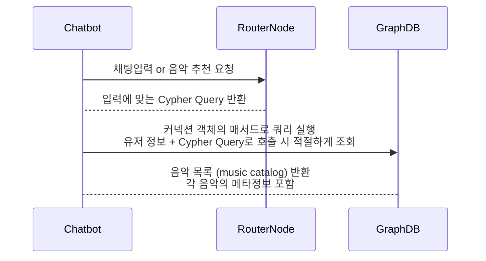

# 시퀸스 다이어 그램

---




# 구현사항 정리 

---

## 1) 라우터 노드 함수 

[Overview]
- 채팅 입력과 유저 정보를 가지고 LLM이 적절한 KAG 쿼리를 찾는 함수 

[input]
- content: 쳇봇에 입력된 유저 채팅
- user_id: 해당 유저를 식별하기 위한 값 (개인화 추천 쿼리에서 사용)
- ml_outputs: user_id로 조회할 수 있는 ml_outputs데이터를 json으로 넘겨받음 또는 함수에서 직접 조회 

[process]
1. 해당 노드에서 유저의 채팅내용과 해당 유저의 메타 정보를 LLM이 받는다. 
2. LLM은 받은 정보를 가지고 KAG_Cypher_Query 중 하나를 선택한다. 
    - KAG_Cypher_Query는 사전에 실행할 쿼리와 인자를 선언해 놓은 enum class
    - LLM은 유저 입력 내용과 쿼리 검색 내용을 읽어서 적절하게 판단해 하나의 쿼리를 선택한다 (내장 함수의 독스트링 등......)

[return]
- KAG_Cypher_Query
- 해당 class 의 독스트링, 정보에 쿼리의 용도와 추천 사유 등이 같이 정리되어 있다. 

---

## 2) 쿼리 실행 함수 

[Overview]
- KAG_Cypher_Query과 입력 정보를 넘겨받으면 적절하게 쿼리를 실행해서 결과를 반환하는 함수 
- 모든 쿼리는 쿼리문 + 인자를 받으면 Music_Catalogs(lst)를 반환하도록 되어 있다, 
- Music_Catalogs(lst)는 쿼리 검색 결과 나온 추천 음악 리스트이다. 
- Music_Catalogs에는 각각 메타 정보가 포함되어 있다. 

[function]
```python
def execute_query(self, query:str="", parameters:dict=None) -> list:
        ''' session.run을 래핑해서 간단한 리스트 형태로 결과를 반환 시킴 '''
        with self.driver.session() as session:
            result = session.run(query, parameters)
            return [record for record in result]
```

[return]
쿼리 실행 결과가 Music_Catalogs(lst) 리스트로 들어 있음

---

## 3) KAG_Cypher_Query

[Overview]
- 실행할 쿼리와 인자들이 정의되어 있는 클래스 
- 선언되는 각 쿼리는 @staticmethod로 래핑된다.

[function]
```python
class KAG_Cypher_Query:
    """ 
    해당 쿼리의 인자들을 메서드 함수로 선언해서 가져온다.
    클래스 내에는 운용하고자 하는 쿼리 만큼의 매서드가 존재할 수 있다. 
    """ 

    @staticmethod
    def mood_search(row: dict):
        """ 
        해당 함수는 유저가 선호하는 mood를 가지고 있는 음악을 검색하는 쿼리 입니다.
        데이터 중에서 필요한 값들을 쿼리에 넣어 실행 쿼리를 구축하게 됩니다. 
        해당 쿼리가 실행될 때 가장 유사하다고 생각하는 샘플 질문을 같이 반환합니다. 
        """

        similar_request = "내가 선호하는 다른 음악들을 추천해줘"

        query = """
        MERGE (m:Mood {mood: $mood})
        """
        parameters = {"mood": row["mood"]}

        return query, parameters, similar_request
```

[return]
1) 연결 객체에 포함된 쿼리/실행 파라미터를 해당 함수로 얻을 수 있음
2) 해당 쿼리를 실행할 때 가장 유사한 질문 샘플을 포함함 


## 4) 쿼리 실행 -> 결과 반환 

[Overview]
- 실제 쿼리 실행 예제
- 실행 결과 반환 형식 포함 

[function]
```python
driver = Neo4j_Connection()

query, parameters, similar_request = query_params(row)
music_catalogs = driver.execute_query(query=query, parameters=parameters)
```

[return]
- 해당 쿼리 실행 시 예상 질문 샘플
- 쿼리 실행 결과 추천된 음악 리스트 
- 각 음악의 메타데이터 / 키워드 


---

# 입력 데이터 정리 

https://www.kaggle.com/datasets/joebeachcapital/30000-spotify-songs?select=readme.md
30000 Spotify Songs 데이터를 추가한다. 

[preprocessing]
1. 데이터는 music_catalog 로 한다. 
2. 필요에 따라 전체 데이터를 다시 받을 수 있도록 하기 위해 원본 데이터는 모두 같은 노드의 추가 정보로 set 한다. 
3. 일부 컬럼의 경우 엣지 연결을 위해 해당 컬럼의 unique 값들을 따로 등록해서 연결하도록 한다. 
4. 추가노드 등록 시에는 중복 방지를 위해 List(set(df['column'])) 형식으로 변환해서 처리한다. 
5. 기본 적제 쿼리는 하나로 구성하고 엣지 연결 쿼리는 엣지당 하나씩 만든다. (유지 보수를 위함)

[analyze-columns]
데이터 중에서 별도 노드로 분류할 컬럼 리스트업 
1. track_artist
2. playlist_genre
3. playlist_subgenre
4. 그외 나머지 컬럼은 라벨링 작업 후 추가 분류 

[edged-columns]
- 음악 데이터의 컬럼 값 노드에 연결되어 있는 추가 메타 정보 
- 직접 음악에 연결된건 아니나 음악 정보에 관련 있는 정보로서 이어져 있어 2홉 이상 검색으로 찾을 수 있도록 되어 있다. 
- teempo -> weather 처럼 연상할 수 있는 키워드 중심으로 구성하게 된다. (해당 부분은 데이터 셋이 따로 있는게 아니라 담당자 들이 기획을 해서 매핑하게 됨 )
- 연결할 키워드는 예상 질문들을 통해 역으로 분석해서 넣게 된다. 


[columns]
track_id	track_name	track_artist	track_popularity	track_album_id	track_album_name	track_album_release_date	playlist_name	playlist_id	playlist_genre	playlist_subgenre	danceability	energy	key	loudness	mode	speechiness	acousticness	instrumentalness	liveness	valence	tempo	duration_ms

- track_name: track_name (트랙 이름부터 표시되도록 하기 위해 먼저 추가)
- track_id: track_id (unique key)

---

# 추천 과정 process 

